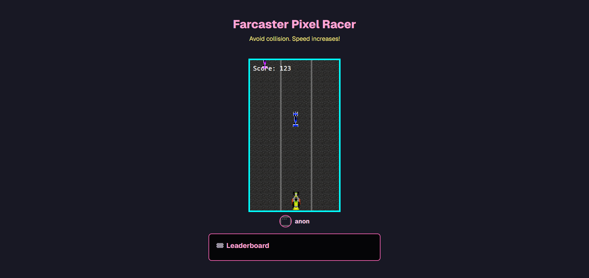

# 🏁 Farcaster Pixel Racer

A retro-style pixel racing game built for the Farcaster ecosystem using Next.js, React, and TypeScript. Players navigate through traffic while avoiding collisions, with scores saved to a Supabase leaderboard.



## 🎮 Game Features

- **Retro Pixel Art Style**: Classic racing game with pixelated graphics
- **Farcaster Integration**: Seamless authentication using Farcaster Mini App SDK
- **Progressive Difficulty**: Speed increases over time for challenging gameplay
- **Leaderboard System**: Global leaderboard with Supabase backend
- **Mobile & Desktop Support**: Touch controls for mobile, keyboard for desktop
- **Responsive Design**: Works on all screen sizes

## 🚀 Quick Start

### Prerequisites

- Node.js 18+ 
- npm or yarn
- Supabase account
- Farcaster account (for full functionality)

### Installation

1. **Clone the repository**
   ```bash
   git clone https://github.com/yourusername/racing.git
   cd racing
   ```

2. **Install dependencies**
   ```bash
   npm install
   ```

3. **Environment Setup**
   
   Create a `.env.local` file in the root directory:
   ```env
   NEXT_PUBLIC_SUPABASE_URL=your_supabase_url
   NEXT_PUBLIC_SUPABASE_ANON_KEY=your_supabase_anon_key
   ```

4. **Run the development server**
   ```bash
   npm run dev
   ```

5. **Open your browser**
   
   Navigate to [http://localhost:3000](http://localhost:3000)

## 🛠️ Tech Stack

- **Frontend**: Next.js 15, React 19, TypeScript
- **Styling**: Tailwind CSS 4
- **Authentication**: Farcaster Mini App SDK
- **Database**: Supabase (PostgreSQL)
- **Deployment**: Vercel-ready

## 🎯 How to Play

### Controls
- **Desktop**: Use arrow keys (← →) to move left and right
- **Mobile**: Swipe left or right to change lanes

### Objective
- Avoid oncoming traffic cars
- Survive as long as possible
- Score points by surviving longer
- Speed increases over time for added challenge

### Scoring
- Points are awarded based on survival time
- Higher scores are saved to the global leaderboard
- Your Farcaster profile picture and username are displayed

## 🏗️ Project Structure

```
racing/
├── public/                 # Static assets
│   ├── *.png              # Game sprites and textures
│   ├── *.wav              # Sound effects
│   └── preview.png        # Game preview image
├── src/
│   └── app/
│       ├── CarRacingGame.tsx    # Main game component
│       ├── Leaderboard.tsx      # Leaderboard display
│       ├── page.tsx             # Main page layout
│       ├── supabaseClient.ts    # Database connection
│       └── layout.tsx           # App layout
├── package.json           # Dependencies and scripts
└── README.md             # This file
```

## 🔧 Configuration

### Supabase Setup

1. Create a new Supabase project
2. Create a `leaderboard` table with the following schema:
   ```sql
   CREATE TABLE leaderboard (
     id UUID DEFAULT gen_random_uuid() PRIMARY KEY,
     username TEXT NOT NULL,
     pfp_url TEXT NOT NULL,
     score INTEGER NOT NULL,
     created_at TIMESTAMP WITH TIME ZONE DEFAULT NOW()
   );
   ```
3. Add your Supabase URL and anon key to `.env.local`

### Farcaster Integration

The game uses the Farcaster Mini App SDK for authentication:
- Automatically detects Farcaster users
- Displays user profile picture and username
- Saves scores with user information

## 🚀 Deployment

### Vercel (Recommended)

1. Push your code to GitHub
2. Connect your repository to Vercel
3. Add environment variables in Vercel dashboard
4. Deploy automatically on push

### Manual Deployment

```bash
npm run build
npm start
```

## 🎨 Customization

### Game Settings

Modify constants in `CarRacingGame.tsx`:
- `START_SPEED`: Initial game speed
- `MAX_SPEED`: Maximum speed limit
- `SPEED_INCREMENT`: How fast speed increases
- `LANES`: Number of traffic lanes

### Visual Customization

- Replace car sprites in `public/` directory
- Modify colors in the `COLORS` object
- Update road texture for different backgrounds

## 🤝 Contributing

1. Fork the repository
2. Create a feature branch (`git checkout -b feature/amazing-feature`)
3. Commit your changes (`git commit -m 'Add amazing feature'`)
4. Push to the branch (`git push origin feature/amazing-feature`)
5. Open a Pull Request

## 📝 License

This project is licensed under the MIT License - see the [LICENSE](LICENSE) file for details.

## 🙏 Acknowledgments

- Farcaster team for the Mini App SDK
- Supabase for the backend infrastructure
- Pixel art community for inspiration
- Next.js team for the amazing framework

## 📞 Support

If you encounter any issues or have questions:

1. Check the [Issues](https://github.com/yourusername/racing/issues) page
2. Create a new issue with detailed information
3. Join the Farcaster community for discussions

---

**Made with ❤️ for the Farcaster ecosystem**
